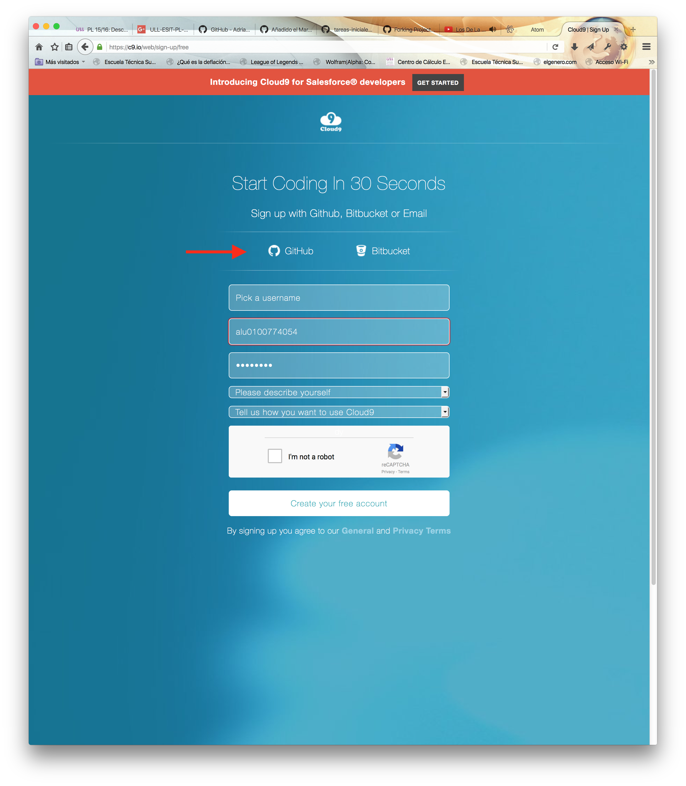
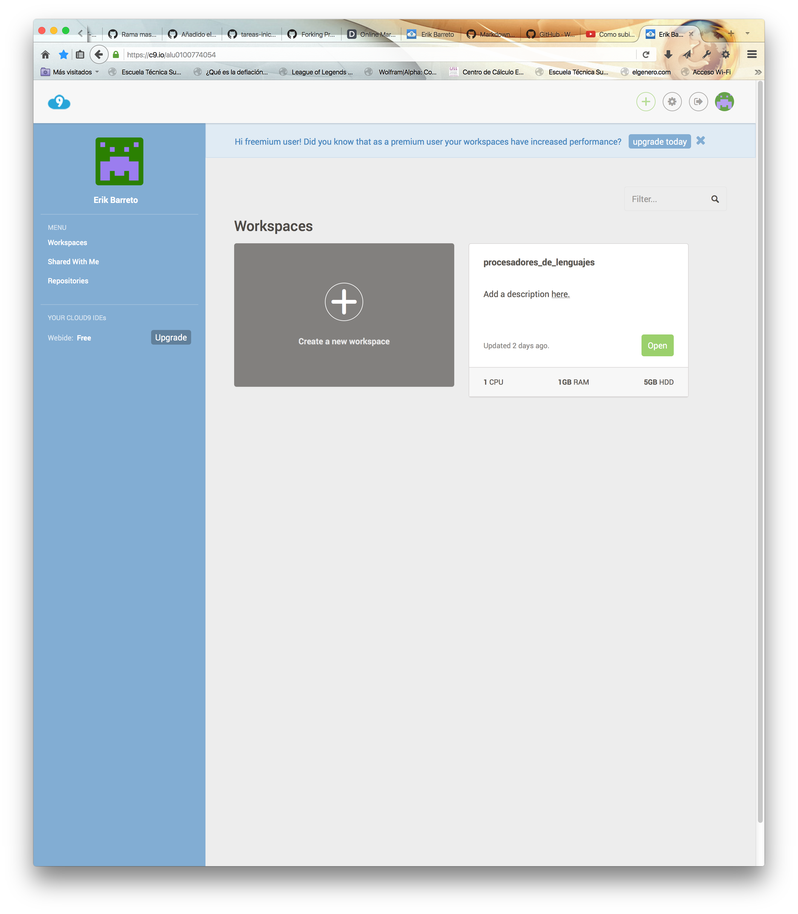
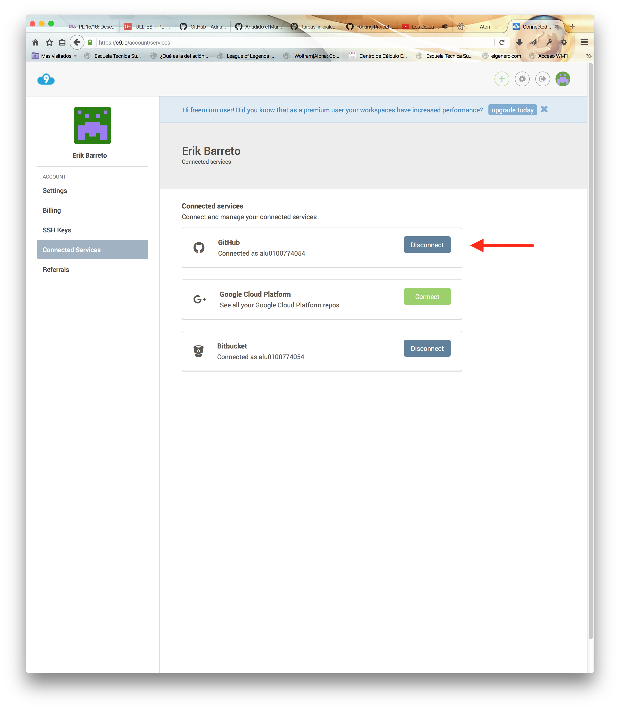
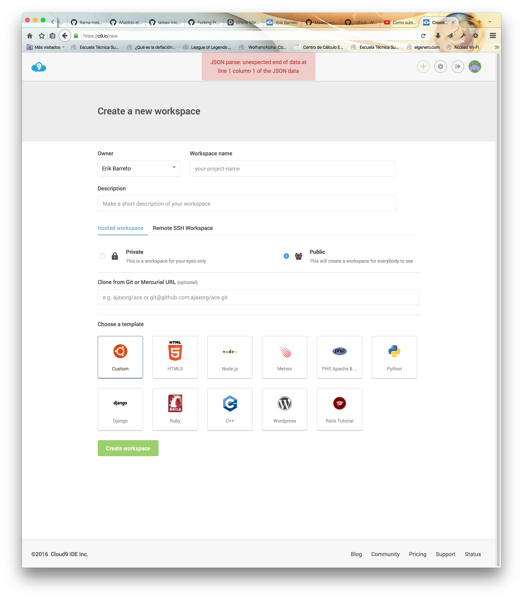
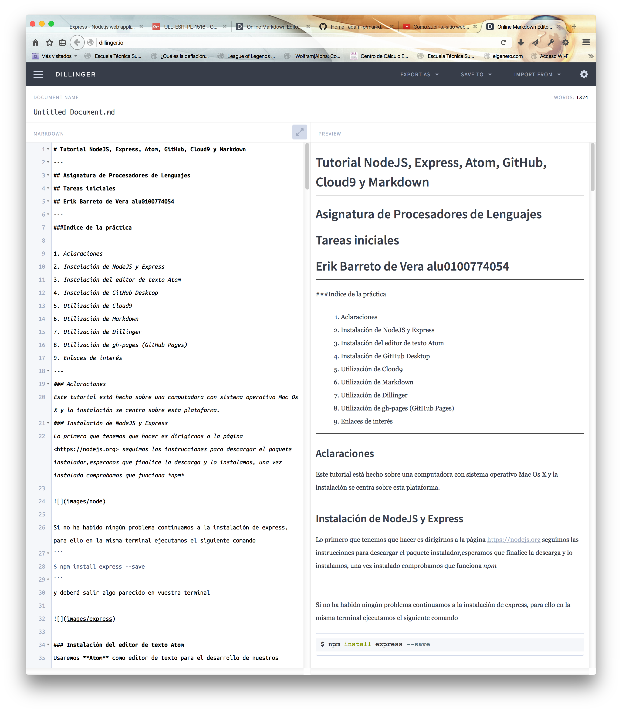

# Tutorial NodeJS, Express, Atom, GitHub, Cloud9 y Markdown
---
## Asignatura de Procesadores de Lenguajes
## Tareas iniciales
## Erik Barreto de Vera alu0100774054
---
###Indice de la práctica

1. Aclaraciones
2. Instalación de NodeJS y Express
3. Instalación del editor de texto Atom
4. Instalación de GitHub Desktop
5. Utilización de Cloud9
6. Utilización de Markdown
7. Utilización de Dillinger
8. Utilización de gh-pages (GitHub Pages)
9. Enlaces de interés
---
### Aclaraciones 
Este tutorial está hecho sobre una computadora con sistema operativo Mac Os X y la instalación se centra sobre esta plataforma.
### Instalación de NodeJS y Express
Lo primero que tenemos que hacer es dirigirnos a la página <https://nodejs.org> seguimos las instrucciones para descargar el paquete instalador,esperamos que finalice la descarga y lo instalamos, una vez instalado comprobamos que funciona *npm* 

 

Si no ha habido ningún problema continuamos a la instalación de express, para ello en la misma terminal ejecutamos el siguiente comando
```
$ npm install express --save
```
y deberá salir algo parecido en vuestra terminal


### Instalación del editor de texto Atom 
Usaremos **Atom** como editor de texto para el desarrollo de nuestros proyectos. Para ello nos dirigimos a <https://atom.io> para descargar el editor siguiendo las instrucciones de la página.


### Instalación de GitHub Desktop

GitHub tiene una aplicación de escritorio multiplataforma que permite administrar los repositorios de una manera sencilla desde su interfaz. Para instalar la aplicación vamos a <https://desktop.github.com> y seguimos las instrucciones para descargar el instalador de la página.


Una vez lo hayamos instalado nos pedirá si poseemos una cuenta de GitHub, en caso de serlo, introducimos los datos, en caso contrario, debemos crear una cuenta o bien desde la interfaz de la aplicación o bien vamos a la página <https://github.com/> y seguimos los pasos para introducir los datos de nuestra nueva cuenta, una vez hayamos terminado podremos usar nuestra aplicación de escritorio.


### Utilización de Cloud9

Antes de comenzar veamos...¿Que beneficios nos aporta?
+ Trabajar colaborativamente.
 Eliminar versiones de código.
+ Acceso a cuentas GitHub y BitBucket
+ Edición de código HTML, CSS, PHP, Java, Ruby y 23 lenguajes mas.
+ Centralización de Código y manejo de versiones (en caso de trabajar con manejador de versiones como git).
+ Control de los cambios realizados.
+ Mantener tu código en la nube (Internet), esto te permite acceder desde cualquier computador con acceso a Internet.

#### ¿Cómo acceder al entorno?
Nos dirigimos a [Cloud 9 IDE](https://c9.io)

 

deberemos crearnos una cuenta si no tenemos ya, seguimos las instrucciones del formulario y una vez creado debe aparecernos algo como:



Aquí vamos a tener que realizar dos acciones:
+ Conectar nuestra cuenta con GitHub para ello vamos a los ajustes de cuenta y dentro de servicios conectados activamos GitHub



+ Crear un espacio de trabajo para ello en el menú principal debemos pinchar en *Create a new workspace* y seguir las instrucciones siguientes:



### Utilización de Markdown

Table of Contents

+ Headers
+ Emphasis
+ Lists
+ Links
+ Images
+ Code and Syntax Highlighting
+ Tables
+ Blockquotes
+ Horizontal Rule
```
# H1
## H2
### H3
#### H4
##### H5
###### H6

Alternatively, for H1 and H2, an underline-ish style:

Alt-H1
======

Alt-H2
------
```
## Resultado
---
# H1
## H2
### H3
#### H4
##### H5
###### H6

Alternatively, for H1 and H2, an underline-ish style:

Alt-H1
======

Alt-H2
------
---
## Emphasis
```
Emphasis, aka italics, with *asterisks* or _underscores_.

Strong emphasis, aka bold, with **asterisks** or __underscores__.

Combined emphasis with **asterisks and _underscores_**.

Strikethrough uses two tildes. ~~Scratch this.~~

Emphasis, aka italics, with asterisks or underscores.

Strong emphasis, aka bold, with asterisks or underscores.

Combined emphasis with asterisks and underscores.

Strikethrough uses two tildes. Scratch this.
```
## Resultado

Emphasis, aka italics, with *asterisks* or _underscores_.

Strong emphasis, aka bold, with **asterisks** or __underscores__.

Combined emphasis with **asterisks and _underscores_**.

Strikethrough uses two tildes. ~~Scratch this.~~

Emphasis, aka italics, with asterisks or underscores.

Strong emphasis, aka bold, with asterisks or underscores.

Combined emphasis with asterisks and underscores.

Strikethrough uses two tildes. Scratch this.
---
## Lists
```
1. First ordered list item
2. Another item
  * Unordered sub-list. 
1. Actual numbers don't matter, just that it's a number
  1. Ordered sub-list
4. And another item.  

   Some text that should be aligned with the above item.

* Unordered list can use asterisks
- Or minuses
+ Or pluses

    First ordered list item
    Another item
        Unordered sub-list.
    Actual numbers don't matter, just that it's a number
        Ordered sub-list

    And another item.

    Some text that should be aligned with the above item.

    Unordered list can use asterisks
    Or minuses
    Or pluses
```
## Resultado
1. First ordered list item
2. Another item
  * Unordered sub-list. 
1. Actual numbers don't matter, just that it's a number
  1. Ordered sub-list
4. And another item.  

   Some text that should be aligned with the above item.

* Unordered list can use asterisks
- Or minuses
+ Or pluses

    First ordered list item
    Another item
        Unordered sub-list.
    Actual numbers don't matter, just that it's a number
        Ordered sub-list

    And another item.

    Some text that should be aligned with the above item.

    Unordered list can use asterisks
    Or minuses
    Or pluses
---
## Links
```
[I'm an inline-style link](https://www.google.com)

[I'm a reference-style link][Arbitrary case-insensitive reference text]

[You can use numbers for reference-style link definitions][1]

Or leave it empty and use the [link text itself]

URLs and URLs in angle brackets will automatically get turned into links. 
http://www.example.com or <http://www.example.com> and sometimes 
example.com (but not on Github, for example).

Some text to show that the reference links can follow later.

[arbitrary case-insensitive reference text]: https://www.mozilla.org
[1]: http://slashdot.org
[link text itself]: http://www.reddit.com
```
## Resultado

[I'm an inline-style link](https://www.google.com)

[I'm a reference-style link][Arbitrary case-insensitive reference text]

[You can use numbers for reference-style link definitions][1]

Or leave it empty and use the [link text itself]

URLs and URLs in angle brackets will automatically get turned into links. 
http://www.example.com or <http://www.example.com> and sometimes 
example.com (but not on Github, for example).

Some text to show that the reference links can follow later.

[arbitrary case-insensitive reference text]: https://www.mozilla.org
[1]: http://slashdot.org
[link text itself]: http://www.reddit.com
---
## Images
```
Here's our logo (hover to see the title text):

Inline-style: 


Reference-style: 
![alt text][logo]

[logo]: https://github.com/adam-p/markdown-here/raw/master/src/common/images/icon48.png "Logo Title Text 2"

```
Inline-style: 


Reference-style: 
![alt text][logo]

[logo]: https://github.com/adam-p/markdown-here/raw/master/src/common/images/icon48.png "Logo Title Text 2"

---
## Code and Syntax Highlighting
```
```javascript
var s = "JavaScript syntax highlighting";
alert(s);```
```
---
## Tables
```
Colons can be used to align columns.

| Tables        | Are           | Cool  |
| ------------- |:-------------:| -----:|
| col 3 is      | right-aligned | $1600 |
| col 2 is      | centered      |   $12 |
| zebra stripes | are neat      |    $1 |

The outer pipes (|) are optional, and you don't need to make the raw Markdown line up prettily. You can also use inline Markdown.

Markdown | Less | Pretty
--- | --- | ---
*Still* | `renders` | **nicely**
1 | 2 | 3
```
## Resultado
Colons can be used to align columns.

| Tables        | Are           | Cool  |
| ------------- |:-------------:| -----:|
| col 3 is      | right-aligned | $1600 |
| col 2 is      | centered      |   $12 |
| zebra stripes | are neat      |    $1 |

The outer pipes (|) are optional, and you don't need to make the raw Markdown line up prettily. You can also use inline Markdown.

Markdown | Less | Pretty
--- | --- | ---
*Still* | `renders` | **nicely**
1 | 2 | 3
---
## Blockquotes
```> Blockquotes are very handy in email to emulate reply text.
> This line is part of the same quote.

Quote break.

> This is a very long line that will still be quoted properly when it wraps. Oh boy let's keep writing to make sure this is long enough to actually wrap for everyone. Oh, you can *put* **Markdown** into a blockquote.
```
## Resultado
> Blockquotes are very handy in email to emulate reply text.
> This line is part of the same quote.

Quote break.

> This is a very long line that will still be quoted properly when it wraps. Oh boy let's keep writing to make sure this is long enough to actually wrap for everyone. Oh, you can *put* **Markdown** into a blockquote.
---
## Horizontal Rule

```
Three or more...

---

Hyphens

***

Asterisks

___

Underscores
```
## Resultado
Three or more...

---

Hyphens

***

Asterisks

___

Underscores

---

## Utilización de Dillinger
Es un editor de Markdown online que permite escribir contenido en formato Markdown en uno de sus paneles y previsualizar el resultado en otro panel, como características está que permite exportarlo en formato HTML o pdf y también guardarlo en servicios en la nube como son DropBox o Google Drive, GitHub, etc.



## Utilización de gh-pages (GitHub Pages)

¿Qué es gh-pages?: Son páginas para ti y para tus proyectos, alojadas directamente en tu repositorio de GitHub: sólo tienes que editar, pushear y los cambios ya estarán disponibles.

¿Cómo se utiliza?: Sólo debes seguir los siguientes pasos en el repositorio de GitHub al que quieras añadir una página:

> 1. Creamos una rama con el nombre 'gh-pages':

> 2. Crea un nuevo fichero
> 3. Llama al fichero index.html
> 4. Haz un commit para el nuevo fichero
> 5. Listo, ahora puedes acceder con la URL 'http://tu-usuario.github.io/nombre-del-repositorio'


**Recursos:**

* [NodeJS](https://nodejs.org)
* [Express](http://expressjs.com)
* [Atom IDE](https://atom.io)
* [GitHub Desktop](https://desktop.github.com)
* [GitHub Pages](https://pages.github.com/)
* [Cloud 9 IDE](https://c9.io)
* [Markdown](http://daringfireball.net/projects/markdown/)
* [Resultado del Markdown HTML](http://alu0100536652.github.io/Tutorial-STW/)
